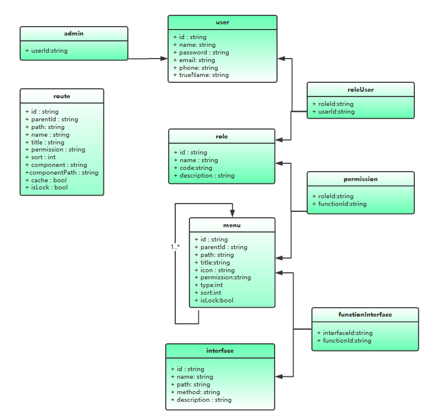

### 运行使用

```bash
npm install

npm start
```

需要后端 mock 服务的支持。

2019 年 3 月 15 日更新`db.json`文件，替换掉`server`项目中的`db.json`和`db_backup.json`，目的是为了同步菜单和路由。

```bash
git clone https://github.com/wjkang/d2-admin-server.git

npm install

npm start
```

### 相关概念



- 实现了 RBAC 模型权限控制
- 菜单与路由独立管理，完全由后端返回
- **user**存储用户
- **admin**标识用户是否为系统管理员
- **role**存储角色信息
- **roleUser**存储用户与角色的关联关系
- **menu**存储菜单信息，类型分为`菜单`与`功能`，一个菜单下可以有多个功能，`菜单`类型的`permission`字段标识访问这个菜单需要的功能权限，`功能`类型的`permission`字段相当于此功能的别称，所以`菜单`类型的`permission`字段为其某个`功能`类型子节点的`permission`值
- **permission**存储角色与功能的关联关系
- **interface**存储接口信息
- **functionInterface**存储功能与接口关联关系，通过查找用户所属角色，再查找相关角色所具备的功能权限，再通过相关功能就可以查出用户所能访问的接口
- **route**存储前端路由信息，通过`permission`字段过滤出用户所能访问的路由

### 运行流程及相关 API

使用`d2admin`的原有登录逻辑，全局路由守卫中判断是否已经拉取权限信息，获取后标识为已获取。

后端需要返回的权限信息包括权限过滤后的角色编码集合，功能编码集合，接口信息集合，菜单列表，路由列表，以及是否系统管理员标识。格式如下

```js
{
  "statusCode": 200,
  "msg": "",
  "data": {
    "userName": "MenuManager",
    "userRoles": [
      "R_MENUADMIN"
    ],
    "userPermissions": [
      "p_menu_view12",
      "p_menu_edit",
      "p_menu_menu"
    ],
    "accessMenus": [
      {
        "title": "系统",
        "path": "/system",
        "icon": "cogs",
        "children": [
          {
            "title": "系统设置",
            "icon": "cogs",
            "children": [
              {
                "title": "菜单管理",
                "path": "/system/menu",
                "icon": "th-list"
              }
            ]
          },
          {
            "title": "组织架构",
            "icon": "pie-chart",
            "children": [
              {
                "title": "部门管理",
                "icon": "html5"
              },
              {
                "title": "职位管理",
                "icon": "opencart"
              }
            ]
          }
        ]
      }
    ],
    "accessRoutes": [
      {
        "name": "System",
        "path": "/system",
        "component": "layoutHeaderAside",
        "componentPath": "layout/header-aside/layout",
        "meta": {
          "title": "系统设置",
          "cache": true
        },
        "children": [
          {
            "name": "MenuPage",
            "path": "/system/menu",
            "component": "menu",
            "componentPath": "pages/sys/menu/index",
            "meta": {
              "title": "菜单管理",
              "cache": true
            }
          },
          {
            "name": "RoutePage",
            "path": "/system/route",
            "component": "route",
            "componentPath": "pages/sys/route/index",
            "meta": {
              "title": "路由管理",
              "cache": true
            }
          },
          {
            "name": "RolePage",
            "path": "/system/role",
            "component": "role",
            "componentPath": "pages/sys/role/index",
            "meta": {
              "title": "角色管理",
              "cache": true
            }
          },
          {
            "name": "UserPage",
            "path": "/system/user",
            "component": "user",
            "componentPath": "pages/sys/user/index",
            "meta": {
              "title": "用户管理",
              "cache": true
            }
          },
          {
            "name": "InterfacePage",
            "path": "/system/interface",
            "component": "interface",
            "meta": {
              "title": "接口管理"
            }
          }
        ]
      }
    ],
    "accessInterfaces": [
      {
        "path": "/menu/:id",
        "method": "get"
      },
      {
        "path": "/menu",
        "method": "get"
      },
      {
        "path": "/menu/save",
        "method": "post"
      },
      {
        "path": "/interface/paged",
        "method": "get"
      }
    ],
    "isAdmin": 0,
    "avatarUrl": "https://api.adorable.io/avatars/85/abott@adorable.png"
  }
}
```

#### 设置菜单

将固定菜单(`/menu/header`、`/menu/aside`)与后端返回的权限菜单(`accessMenus`)合并后，存入相应的 vuex store 模块中

```js
...
let allMenuAside = [...menuAside, ...permissionMenu]
let allMenuHeader = [...menuHeader, ...permissionMenu]
...
// 设置顶栏菜单
store.commit('d2admin/menu/headerSet', allMenuHeader)
// 设置侧边栏菜单
store.commit('d2admin/menu/fullAsideSet', allMenuAside)
// 初始化菜单搜索功能
store.commit('d2admin/search/init', allMenuHeader)
```

#### 处理路由

默认使用`routerMapComponents` 的方式处理后端返回的权限路由

```js
//处理动态添加的路由
const formatRoutes = function (routes) {
    routes.forEach(route => {
        route.component = routerMapComponents[route.component]
        if (route.children) {
        formatRoutes(route.children)
        }
    })
}
...
formatRoutes(permissionRouter)
//动态添加路由
router.addRoutes(permissionRouter);
// 处理路由 得到每一级的路由设置
store.commit('d2admin/page/init', [...frameInRoutes, ...permissionRouter])
```

#### 设置权限信息

将角色编码集合，功能编码集合，接口信息集合，以及是否系统管理员标识存入相应的 vuex store 模块中

```js
...
permission.functions = userPermissionInfo.userPermissions
permission.roles = userPermissionInfo.userRoles
permission.interfaces = util.formatInterfaces(userPermissionInfo.accessInterfaces)
permission.isAdmin = userPermissionInfo.isAdmin == 1
...
// 设置权限信息
store.commit('d2admin/permission/set', permission)
```

#### 接口权限控制以及 loading 配置

支持使用角色编码，功能编码以及接口权限进行控制，如下

```js
export function getMenuList() {
  return request({
    url: '/menu',
    method: 'get',
    interfaceCheck: true,
    permission: ['p_menu_view'],
    loading: {
      type: 'loading',
      options: {
        fullscreen: true,
        lock: true,
        text: '加载中...',
        spinner: 'el-icon-loading',
        background: 'rgba(0, 0, 0, 0.8)'
      }
    },
    success: {
      type: 'message',
      options: {
        message: '加载菜单成功',
        type: 'success'
      }
    }
  })
}
```

`interfaceCheck: true`表示使用接口权限进行控制，如果 vuex store 中存储的接口信息与当前要请求的接口想匹配，则可发起请求，否则请求将被拦截。

`permission:["p_menu_view"]`表示使用角色编码和功能编码进行权限校验，如果 vuex store 中存储的角色编码或功能编码与当前表示的编码相匹配，则可发起请求，否则请求将被拦截。

源码位置在`libs/permission.js`，可根据自己需求进行修改。

`loading`配置相关源码在`libs/loading.js`，根据自己需求进行配置，`success`也是如此，源码在`libs/loading.js`。 照此思路可以自行配置其它功能，比如请求失败等。

#### 页面元素权限控制

使用指令`v-permission`：

```html
<el-button
  v-permission:function.all="['p_menu_edit']"
  type="primary"
  icon="el-icon-edit"
  size="mini"
  @click="batchEdit"
  >批量编辑</el-button
>
```

参数可为`function`、`role`，表明以功能编码或角色编码进行校验，为空则使用两者进行校验。

修饰符`all`，表示必须全部匹配指令值中所有的编码。

源码位置在`plugin/permission/index.js`，根据自己实际需求进行修改。

使用`v-if`+全局方法：

```html
<el-button
  v-if="canAdd"
  type="primary"
  icon="el-icon-circle-plus-outline"
  size="mini"
  @click="add"
  >添加</el-button
>
```

```js
data() {
    return {
      canAdd: this.hasPermissions(["p_menu_edit"])
    };
  },
```

默认同时使用角色编码与功能编码进行校验，有一项匹配即可。

类似的方法还要`hasFunctions`，`hasRoles`。

源码位置在`plugin/permission/index.js`，根据自己实际需求进行修改。

> 不要使用`v-if="hasPermissions(['p_menu_edit'])"`这种方式，会导致方法多次执行

也可以直接在组件中从 vuex store 读取权限信息进行校验。

#### 模态框loadding在'5000'时无法取消解决办法

例如：
```
postService.addPost(data).then(data => {
  this.loading = false //请求成功取消loading
  if (!data.hasOwnProperty('code')) { //判断是否2000
    this.dialogVisible = false  //模态框关闭
    this.$emit('submit')
  }
})
```

### 开发建议

- 页面级别的组件放到`pages/`目录下，并且在`routerMapCompnonents/index.js`中以 key-value 的形式导出

- 不需要权限控制的固定菜单放到`menu/aside.js`和`menu/header.js`中

- 不需要权限控制的路由放到`router/routes.js` `frameIn`内

- 需要权限控制的菜单与路由通过界面的管理功能进行添加，确保菜单的`path`与路由的`path`相对应，路由的`name`与页面组件的`name`一致才能使`keep-alive`生效，路由的`component`在`routerMapCompnonents/index.js`中能通过 key 匹配到。

- 一级目录文件统一命名为`xxx.xx`，二级目录统一命名为`xxx-xxx.xx`。如：角色管理->`role-management.vue`

- 代码格式化参照`.eslintrc.js`文件

- 总之 Happy Coding!!!

Copyright (c) 2019-present Boyafairyland
